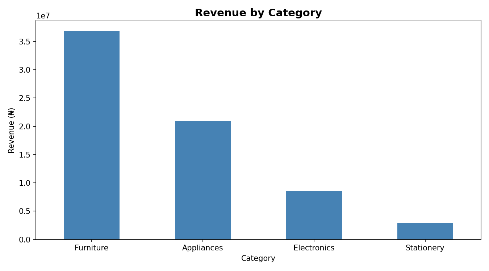
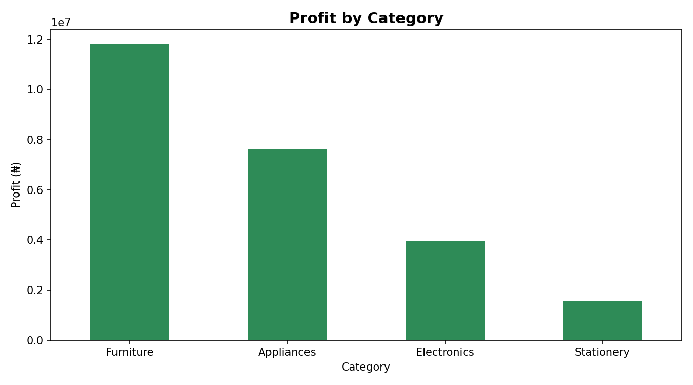
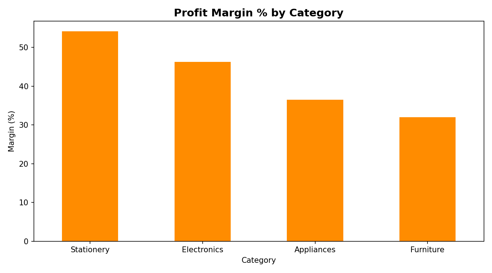
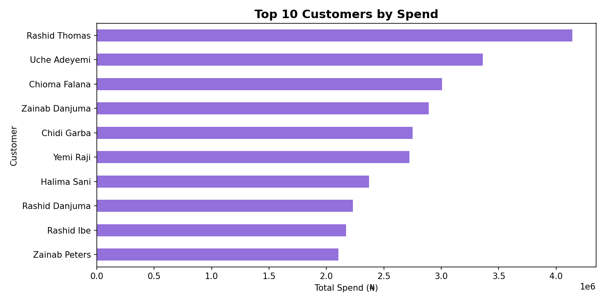
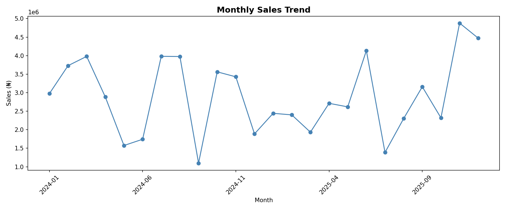

# Retail Sales Analysis — SQL, Power BI & Python

A retail sales analysis answering five business questions about sales, profit, and customers across 2024–2025 — completed three ways (SQL, Power BI, and Python) to demonstrate the same insights across the core analyst toolset.

**Skills shown:** multi-table JOINs, aggregation (`SUM`, `COUNT`, `AVG`), `GROUP BY`, calculated columns, profit-margin ratios, date-based trend analysis, Power BI dashboarding, and pandas/matplotlib.

---

## The Data

A normalized retail database of **427 orders**, **60 customers**, and **22 products** across five regions (Lagos, Abuja, Port Harcourt, Kano, Ibadan), spanning January 2024 – December 2025.

| Table | Key columns | Description |
|-------|-------------|-------------|
| `customers` | cust_id, name, region, segment | Who placed orders |
| `products` | product_id, product_name, category, unit_price, unit_cost | What was sold (price **and** cost — enabling profit analysis) |
| `orders` | order_id, cust_id, product_id, quantity, sale_amount, order_date | Each transaction |

Tables link via `orders.cust_id → customers.cust_id` and `orders.product_id → products.product_id`.

---

# Part 1 — SQL Analysis

## Question 1 — Which product category generates the most revenue?

```sql
SELECT products.category, SUM(orders.sale_amount) AS total_revenue
FROM orders
JOIN products ON orders.product_id = products.product_id
GROUP BY products.category
ORDER BY total_revenue DESC;
```

| Category | Revenue (₦) |
|----------|------------:|
| Furniture | 36,836,750 |
| Appliances | 20,908,450 |
| Electronics | 8,566,375 |
| Stationery | 3,272,885 |

**Insight:** Furniture is the clear revenue leader at ₦36.8M — more than Electronics and Stationery combined, and nearly double Appliances. Revenue is heavily concentrated in the top two categories. *However, revenue alone does not indicate profitability — see Question 3.*

---

## Question 2 — Which category generates the most profit?

Profit is not stored; it is calculated as `quantity × (unit_price − unit_cost)`.

```sql
SELECT products.category,
       SUM(orders.quantity * (products.unit_price - products.unit_cost)) AS total_profit
FROM orders
JOIN products ON orders.product_id = products.product_id
GROUP BY products.category
ORDER BY total_profit DESC;
```

| Category | Profit (₦) |
|----------|-----------:|
| Furniture | 11,801,150 |
| Appliances | 7,637,340 |
| Electronics | 3,968,450 |
| Stationery | 1,825,525 |

**Insight:** Furniture also leads on total profit (₦11.8M), confirming it as the single biggest profit driver in absolute terms. But total profit follows the same ranking as revenue — which raises the question of *efficiency*: is Furniture profitable because it's well-margined, or simply because it sells in large volumes?

---

## Question 3 — Which category is most profit-efficient (margin)?

Profit margin = profit ÷ revenue × 100.

```sql
SELECT products.category,
       SUM(orders.quantity * (products.unit_price - products.unit_cost)) AS total_profit,
       SUM(orders.sale_amount) AS total_revenue,
       ROUND(
         SUM(orders.quantity * (products.unit_price - products.unit_cost)) * 100.0
         / SUM(orders.sale_amount)
       , 1) AS margin_percent
FROM orders
JOIN products ON orders.product_id = products.product_id
GROUP BY products.category
ORDER BY margin_percent DESC;
```

| Category | Profit (₦) | Revenue (₦) | Margin |
|----------|-----------:|------------:|-------:|
| Stationery | 1,825,525 | 3,272,885 | 55.8% |
| Electronics | 3,968,450 | 8,566,375 | 46.3% |
| Appliances | 7,637,340 | 20,908,450 | 36.5% |
| Furniture | 11,801,150 | 36,836,750 | 32.0% |

**Insight — the key finding:** Margin runs *inversely* to revenue. Furniture earns the most total profit but is the **least** efficient category, keeping only 32 kobo of every naira sold. Stationery, the smallest earner, is the **most** efficient at 55.8%. Takeaway for the business: Furniture drives profit through sheer volume, but growing the high-margin categories (Stationery, Electronics) would lift profitability faster per naira of sales — a balanced strategy beats chasing revenue alone.

---

## Question 4 — Who are the top 10 customers by spend?

```sql
SELECT customers.name, SUM(orders.sale_amount) AS total_spent
FROM orders
JOIN customers ON orders.cust_id = customers.cust_id
GROUP BY customers.name
ORDER BY total_spent DESC
LIMIT 10;
```

| Rank | Customer | Total Spent (₦) |
|-----:|----------|----------------:|
| 1 | Rashid Thomas | 4,139,485 |
| 2 | Uche Adeyemi | 3,361,950 |
| 3 | Chioma Falana | 3,008,250 |
| 4 | Zainab Danjuma | 2,891,700 |
| 5 | Chidi Garba | 2,750,360 |
| 6 | Yemi Raji | 2,721,200 |
| 7 | Halima Sani | 2,370,000 |
| 8 | Rashid Danjuma | 2,230,450 |
| 9 | Rashid Ibe | 2,171,550 |
| 10 | Zainab Peters | 2,102,550 |

**Insight:** The top customer (Rashid Thomas, ₦4.1M) spent nearly double the #10 customer, showing meaningful revenue concentration among top accounts. These are the relationships the business should prioritise for retention and loyalty efforts — losing one top-10 customer costs far more than losing an average one.

---

## Question 5 — How do sales trend month over month?

```sql
SELECT strftime('%Y-%m', order_date) AS month, SUM(sale_amount) AS monthly_sales
FROM orders
GROUP BY month
ORDER BY month;
```

Monthly sales ranged from a low of **₦1.1M (Sep 2024)** to a high of **₦4.9M (Nov 2025)**.

**Insight:** Sales are highly variable month to month with no clean seasonal cycle, though the strongest months cluster in late 2025 (Nov–Dec 2025 were the two highest in the dataset). Rather than assume a seasonal pattern that the data does not support, the honest read is that demand is volatile — which itself argues for maintaining flexible inventory rather than betting on fixed seasonal peaks.

---

# Part 2 — Power BI Dashboard

The same analysis, visualised as an interactive Power BI dashboard:


The dashboard presents all five business questions at a glance — revenue by category, the monthly sales trend, top customers, and the key revenue-vs-margin finding: the highest-revenue category (Furniture) has the lowest profit margin. Built in Power BI Desktop from the same dataset, using table relationships and calculated measures (Total Profit, Profit Margin %) that mirror the SQL logic.

---

# Part 3 — Python (pandas) Analysis

The same retail analysis, reproduced in Python using pandas and matplotlib — demonstrating the full workflow from raw CSV to polished charts in a third toolset.

**Skills shown:** pandas (`read_csv`, `merge`, `groupby`, filtering, calculated columns, date handling with `to_datetime`), matplotlib charting, and reproducing SQL logic in Python. The Jupyter notebook (`retail_analysis.ipynb`) contains the full code.

### Revenue by Category


### Profit by Category


### Profit Margin % by Category


The same core finding holds across all three tools: the highest-revenue category (Furniture) has the lowest profit margin, while the smallest category (Stationery) is the most margin-efficient.

### Top 10 Customers


### Monthly Sales Trend


---

## What this project demonstrates

- Joining and aggregating across a normalized multi-table database
- Distinguishing **revenue from profit from margin** — and why conflating them misleads
- Calculating derived metrics (profit, margin) not stored in the raw data
- Reading data honestly, including stating what the data does *not* show
- Delivering the same analysis across **three tools** — SQL, Power BI, and Python

*Dataset is synthetic, generated for analysis practice. Built as Portfolio Project #1.*
